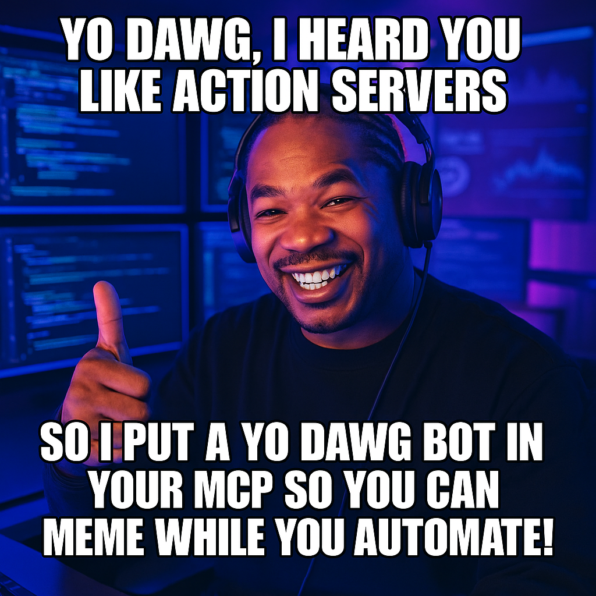

# Yo Dawg Sema4ai Action Server/MCP

This project is an advanced Sema4ai Action Server that automatically generates and posts custom "Yo Dawg" meme comments (with images) on LinkedIn posts using the Model Context Protocol (MCP).



## Features
- 🤖 Autonomous meme generation and posting
- 🖼️ AI-generated meme images with custom captions
- 📡 Powered by Model Context Protocol (MCP)
- 🎯 Official signature for every comment
- Robust browser automation using Playwright via Robocorp

## How It Works
1. The action visits a LinkedIn post URL.
2. It extracts the post content and generates a "Yo Dawg" meme caption using AI.
3. It creates a meme image with the caption and uploads it as a comment.
4. The comment includes an official signature:
   > 🎯 This content was generated by The Yo Dawg Sema4ai Action Server
   > 📡 Powered by Model Context Protocol (MCP)
   > 🤖 Autonomous meme generation system active

## Usage
- See `src/yodawg/linkedin.py` for the main action logic.
- The action can be triggered with a LinkedIn post URL to automatically comment with a meme.
- Images are saved in the `yo-dawg-images/` directory.

## Requirements
- Python 3.11+
- Sema4ai Actions
- Robocorp Browser
- OpenAI API key (for meme generation)
- **You must connect your agent (with tool access) to the `/mcp/` endpoint to enable Model Context Protocol features.**

## Example
```shell
action-server start
```

## Project Structure
- `src/yodawg/yo-dawg-actions.py`: Main action logic
- `src/yodawg/image_generation.py`: Meme caption and image generation
- `src/yodawg/models.py`: Data models
- `yo-dawg-images/`: Generated meme images


## License
See `LICENSE` for details.

---
For more information, see the [Sema4ai Actions documentation](https://sema4.ai/docs/solutions/document-intelligence/get-started-with-doc-intel/test-drive-worker-agent/worker_agent_runbook_and_actions#working-with-actions).