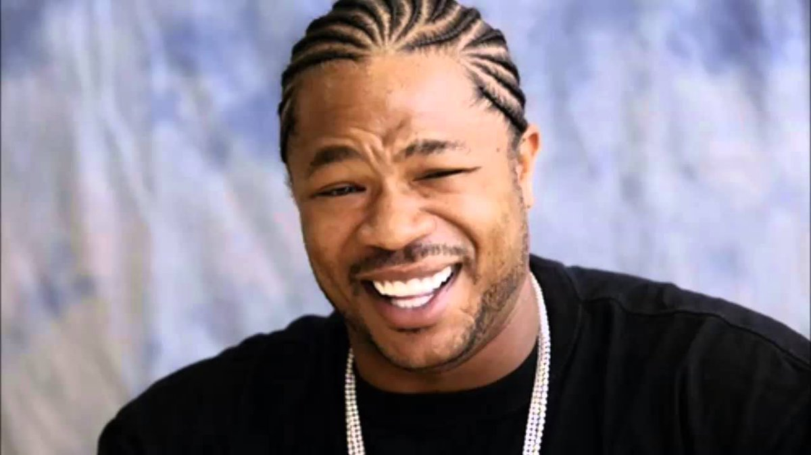

# Yo Dawg Sema4ai Action Server/MCP

This project is an advanced Sema4ai Action Server that automatically generates and posts custom "Yo Dawg" meme comments (with images) on LinkedIn posts using the Model Context Protocol (MCP).



## Features
- 🤖 Autonomous meme generation and posting
- 🖼️ AI-generated meme images with custom captions
- 📡 Powered by Model Context Protocol (MCP)
- 🎯 Official signature for every comment
- Robust browser automation using Playwright via Robocorp

## How It Works
1. The action visits a LinkedIn post URL.
2. It extracts the post content and generates a "Yo Dawg" meme caption using AI.
3. It creates a meme image with the caption and uploads it as a comment.
4. The comment includes an official signature:
   > 🎯 This content was generated by The Yo Dawg Sema4ai Action Server
   > 📡 Powered by Model Context Protocol (MCP)
   > 🤖 Autonomous meme generation system active

## Available Actions

This action server exposes several callable actions via MCP:

### 1. `generate_yo_dawg_quote_only`
Generate only the Yo Dawg meme caption from provided content.
**Parameters:**
- `yo_dawg_content` (str): The content to transform into a Yo Dawg meme caption.
- `model` (str, optional): Model name to use for generation.
**Returns:** Caption string.

### 2. `rich_mans_yo_dawg_comment`
Generate and post a Yo Dawg meme comment on LinkedIn by creating a new image.
**Parameters:**
- `post_url` (str, optional): The LinkedIn post URL to comment on.
- `custom_context` (str, optional): Custom context string for meme generation.
- `append_custom_context` (bool): If true, appends custom context to LinkedIn post content.
**Returns:** Result message and generated image.

### 3. `poor_mans_yo_dawg_comment`
Generate and post a Yo Dawg meme comment on LinkedIn by overlaying text on a static image.
**Parameters:**
- `post_url` (str, optional): The LinkedIn post URL to comment on.
- `custom_context` (str, optional): Custom context string for meme generation.
- `append_custom_context` (bool): If true, appends custom context to LinkedIn post content.
**Returns:** Result message and generated image.

### 4. Internal Utilities
- Meme image and caption generation (`yo_dawg_generator`, `YoDawgImageGenerator`)
- LinkedIn post content extraction
- Browser automation for posting comments

## Usage
- See `src/yodawg/yo-dawg-actions.py` for main action logic and all callable actions.
- Actions can be triggered via MCP endpoints or Sema4ai agent tool access.
- Images are saved in the `yo-dawg-images/` directory.

## Requirements

## Example
```shell
action-server start
```

## Project Structure
- `src/yodawg/yo-dawg-actions.py`: Main action logic and all MCP actions
- `src/yodawg/image_generation.py`: Meme caption and image generation
- `src/yodawg/models.py`: Data models
- `yo-dawg-images/`: Generated meme images


## License
See `LICENSE` for details.

---
For more information, see the [Sema4ai Actions documentation](https://sema4.ai/docs/solutions/document-intelligence/get-started-with-doc-intel/test-drive-worker-agent/worker_agent_runbook_and_actions#working-with-actions).